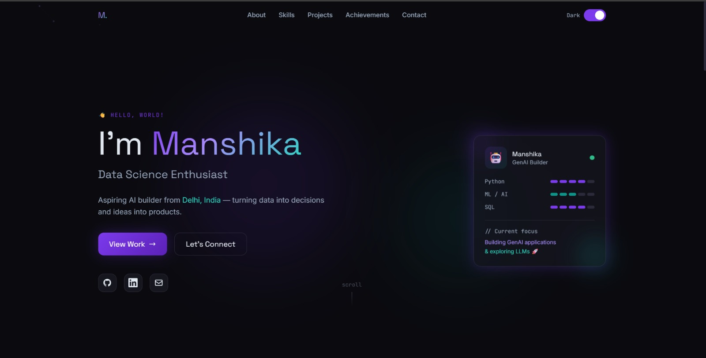
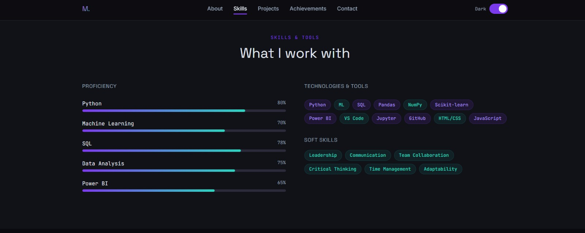
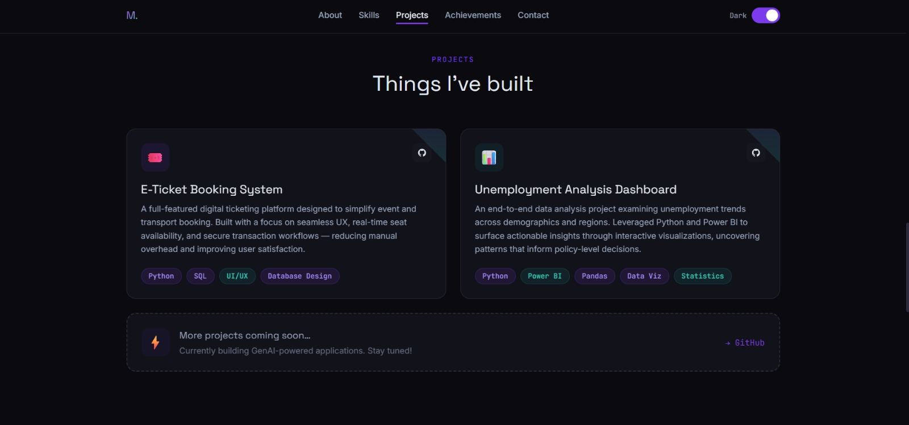

# Day 10 – Build Your Personal Portfolio Website

## Objective

Create a modern personal portfolio website using Claude Artifacts and showcase personal information, skills, projects, and contact details.

## Tools Used

* Claude
* VS Code
* GitHub
* HTML
* CSS

## Project Overview

For Day 10, I created my own portfolio website using AI. The website was designed to represent my personal brand and present my skills, projects, and profile in a clean and modern layout.

## Features Included

* Hero Section
* About Me
* Skills Section
* Projects Showcase
* Contact Section
* Responsive Design
* Modern UI Layout

## About Me

I am an aspiring AI and web development enthusiast passionate about creating modern digital experiences and learning new technologies. I enjoy building projects and improving my technical skills through practical challenges.

## Steps Followed

1. Opened Claude and started a new conversation.
2. Used the provided portfolio prompt template.
3. Added my personal information.
4. Generated the website code.
5. Saved the output as an HTML file.
6. Tested the portfolio in the browser.
7. Captured screenshots.
8. Uploaded everything to GitHub.

## What I Learned

* How AI can generate websites quickly
* Portfolio website structure
* Personal branding fundamentals
* HTML organization and testing
* GitHub project submission workflow

## Challenges Faced

Initially organizing the content and customizing the generated portfolio required some adjustments, but testing and refining improved the final result.

## Outcome

Successfully created and tested a modern portfolio website and uploaded the project files to GitHub.

## Screenshots

 
