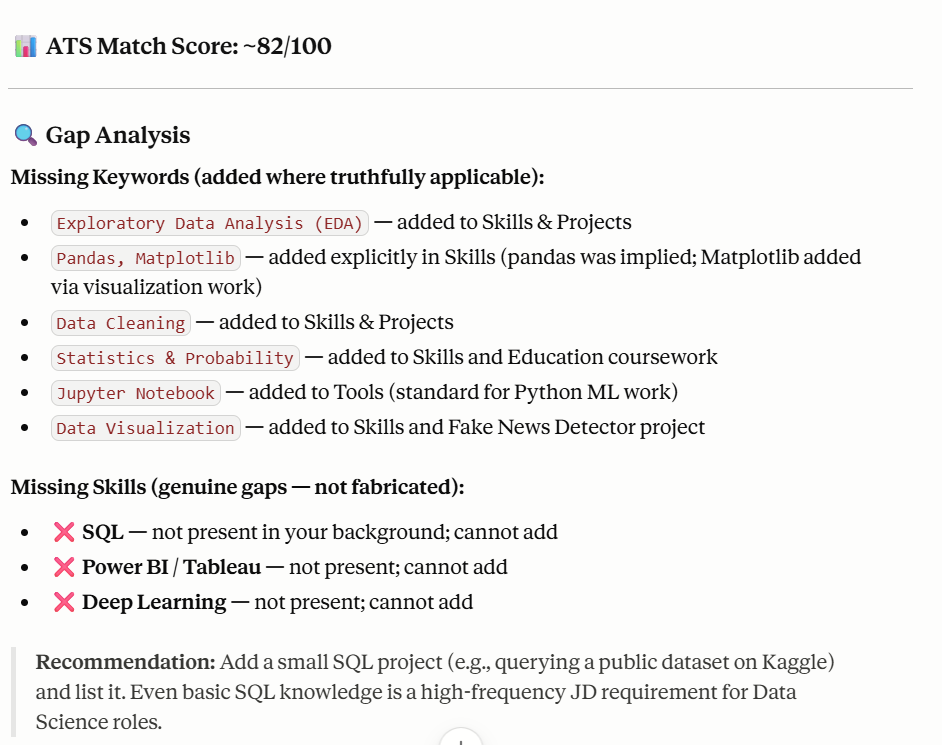
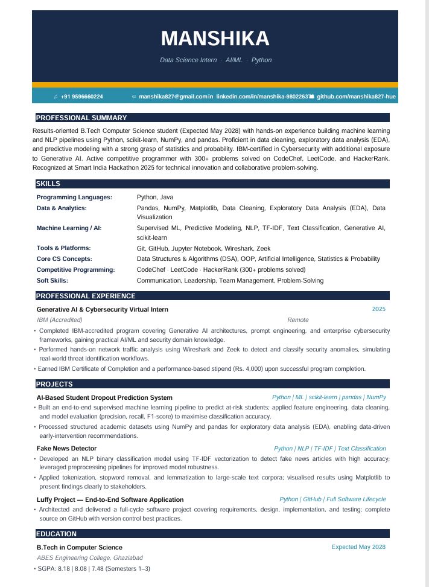
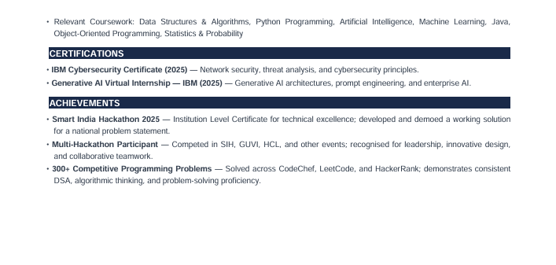

# Day 11 — ATS Resume Optimizer & Resume Generator

## Objective

Learn how Applicant Tracking Systems (ATS) evaluate resumes and improve resume quality using AI while maintaining factual accuracy.

---

## Tools Used

* Claude
* Resume (Existing Version)
* Target Job Description
* GitHub

---

## Target Role

Data Science Intern

---

## ATS Analysis

### ATS Match Score

(Write your score here)

Example:
ATS Match Score: 78%

---

## Gap Analysis

### Missing Keywords

* Data Analysis
* Machine Learning
* SQL
* Data Visualization

### Missing Skills

* Power BI
* Tableau
* Advanced Python

### Improvement Opportunities

* Improve professional summary
* Add project impact descriptions
* Align resume keywords with job description
* Improve ATS formatting

---

## Resume Optimization Summary

Changes made:

* Improved resume structure
* Added better keyword alignment
* Reorganized sections for readability
* Enhanced professional summary
* Optimized formatting for ATS systems

---

## Optimized Resume

---

## Screenshots

### ATS Analysis Screenshot

### Optimized Resume Screenshot

---

## Key Learnings

Today I learned:

* ATS systems filter resumes before recruiters review them.
* Keyword alignment improves resume visibility.
* Resume formatting impacts ATS readability.
* AI can improve resume quality without adding false information.

---

## Conclusion

This task helped me understand how resumes are evaluated and how strategic optimization can improve application readiness while keeping content truthful and professional.

#60DayClaudeChallenge
