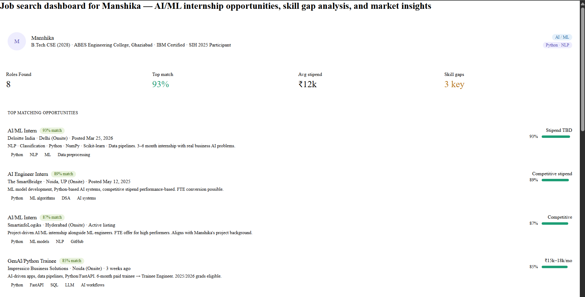
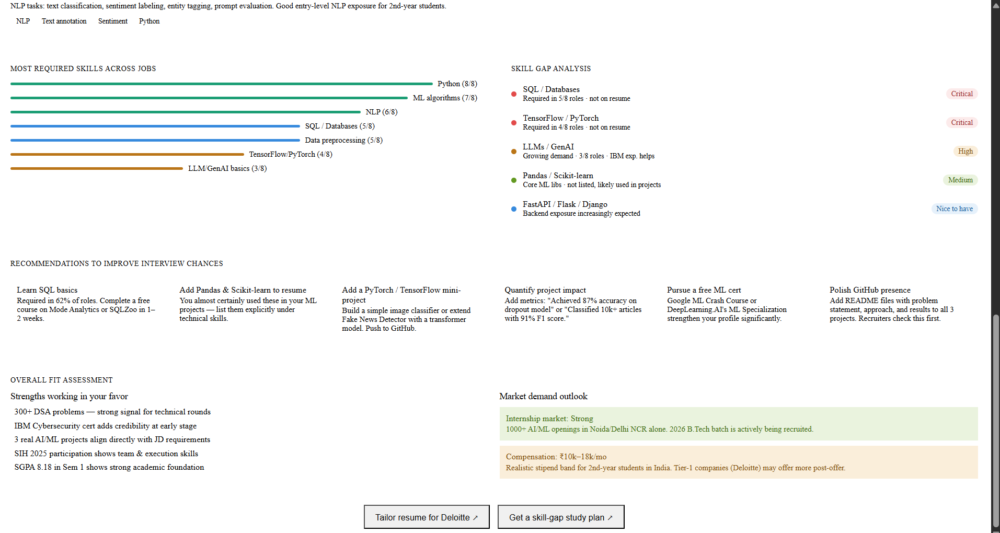

# Day 13 – Build Your AI Job Search Assistant

## Objective

Built an AI-powered job search workflow using Claude Connectors and Indeed to discover opportunities, analyze job fit, and identify skills required for career growth.

---

## Tools Used

* Claude
* Claude Connectors
* Indeed Connector
* GitHub

---

## Professional Profile Summary

I created a professional profile focused on entry-level opportunities in Data Science and AI.

Profile highlights:

* BTech Student
* Interested in Data Science and Machine Learning
* Skills: Python, Pandas, NumPy, SQL, Git, GitHub, HTML, CSS
* Exploring AI applications and analytics

---

## Job Search Criteria

Configured Claude to search based on:

* Target Roles:

  * Data Science Intern
  * Data Analyst Intern
  * Machine Learning Intern
  * AI Intern

* Preferred Work Mode:

  * Remote / Hybrid

* Experience:

  * Fresher / Entry-Level

* Location:

  * India

* Job Recency:

  * Recent openings

---

## Discovered Opportunities

(Add screenshots here)

Example Format:

| Company         | Role                | Match Score | Location |
| --------------- | ------------------- | ----------- | -------- |
| Example Company | Data Analyst Intern | 88%         | Remote   |

---

## Skill Gap Analysis

Skills commonly requested across opportunities:

* Python
* SQL
* Machine Learning
* Data Visualization
* Problem Solving
* Communication

Areas to improve:

* Build more project experience
* Strengthen SQL concepts
* Practice interview questions
* Improve portfolio quality

---

## Market Demand Insights

Insights from AI analysis:

* Data and AI roles continue to grow.
* Recruiters value projects and practical skills.
* ATS-friendly resumes increase visibility.
* Strong GitHub profiles improve credibility.

---

## Recommendations

To improve interview chances:

1. Build more portfolio projects
2. Practice SQL and analytics
3. Optimize LinkedIn profile
4. Continue applying consistently
5. Learn industry tools and workflows

---

## Key Learnings

* AI can speed up job discovery.
* Match scores help prioritize applications.
* Skill-gap analysis creates a focused learning roadmap.
* Personalized search gives better opportunities.

---

## Screenshots

Insert your screenshots below.

---

## GitHub Repository

(Add GitHub commit URL here)
