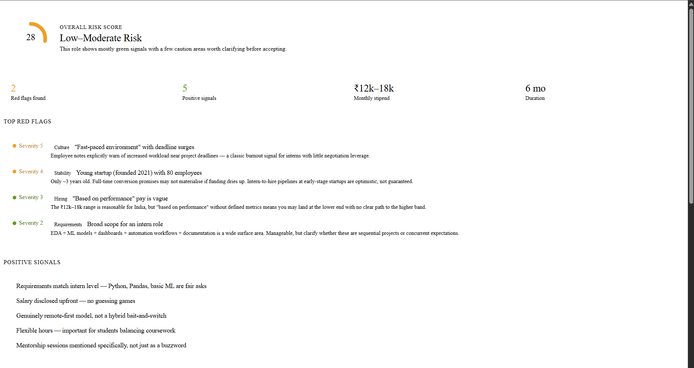
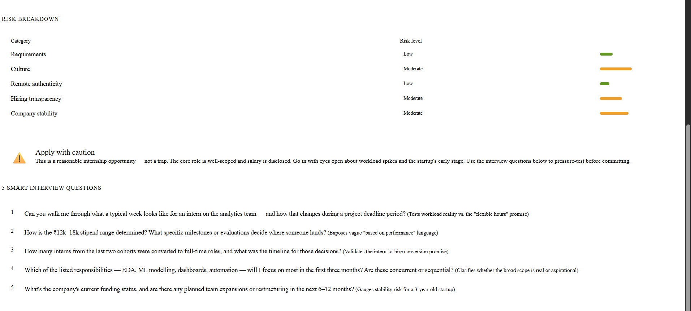

# Day 14 — AI Job Red Flag Detector

## Objective

Analyze a job opportunity using AI and identify potential risks before investing time in the application process.

---

## Job Details

**Position:** Data Science Intern
**Company:** InsightEdge Analytics
**Location:** Remote (India)
**Duration:** 6 Months

---

## Company Information

InsightEdge Analytics is an AI and Business Analytics startup that provides predictive analytics and reporting solutions for businesses.

Company highlights:

* Remote-first work culture
* Approximately 80 employees
* Learning-focused environment
* Internship-to-full-time opportunity
* Collaborative team structure

---

## AI Job Risk Analysis Summary

### Overall Risk Score

35 / 100 → Low–Moderate Risk

### Positive Signals

* Clear technical requirements
* Opportunity for mentorship
* Remote flexibility
* Internship conversion possibility
* Hands-on project exposure

### Red Flags

* Compensation depends on performance
* Startup workload may vary
* Limited information about structured career growth

---

## Risk Breakdown

| Category               | Risk Level |
| ---------------------- | ---------- |
| Compensation Risk      | Medium     |
| Growth Risk            | Low        |
| Work-Life Balance Risk | Medium     |
| Job Stability Risk     | Medium     |

---

## Final Verdict

Apply Carefully

This role appears suitable for gaining practical experience in Data Science and analytics. However, candidates should clarify expectations around workload, mentorship, and conversion opportunities.

---

## Interview Questions Generated

1. What does success look like during this internship?
2. Is there a structured mentorship program?
3. What percentage of interns receive full-time offers?
4. How is performance evaluated?
5. What projects will I work on?

---

## Key Learnings

* A good job opportunity should be evaluated beyond salary.
* Company culture and growth opportunities matter.
* AI can help identify hidden risks in job descriptions.
* Asking better interview questions improves decision-making.

---

## Screenshots

---
 
