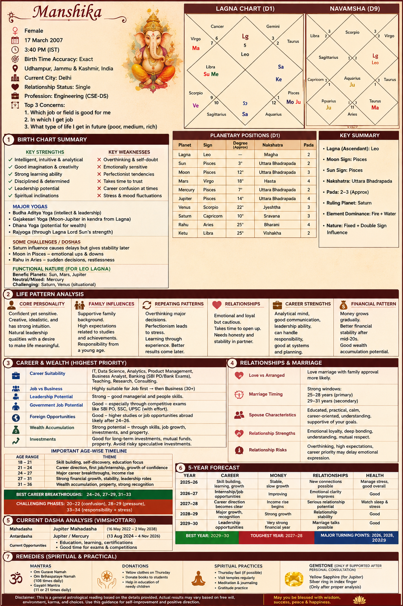

# Day 15 – AI Astrology Report Generator

## Overview

For Day 15, I created an AI-powered Vedic astrology report and transformed the output into a visually structured infographic. The project focused on organizing user details into sections covering personality insights, career outlook, life forecasting, and presentation design.

---

## Objective

Create a visually engaging astrology-style report that:

* Accepts user birth information
* Generates structured insights
* Organizes predictions into categories
* Presents the result in infographic format

---

## Features

✅ Birth Chart Summary
✅ Life Pattern Analysis
✅ Career & Wealth Insights
✅ Relationship Overview
✅ Current Dasha Interpretation
✅ Five-Year Forecast
✅ Remedies & Recommendations
✅ Visual Infographic Design

---

## What I Learned

* Structuring large information into readable sections
* Presenting insights through visual storytelling
* Improving content hierarchy and formatting
* Creating organized infographic layouts using AI
* Converting text-heavy outputs into attractive designs

---

## Challenges Faced

* Managing multiple sections in one design
* Maintaining readability
* Organizing charts and summaries
* Creating balanced visual layouts

---

## Key Takeaway

This project showed how AI can help create interactive and visually engaging reports while improving information presentation and organization.

---

## Screenshot

### Final Output Preview

 

 