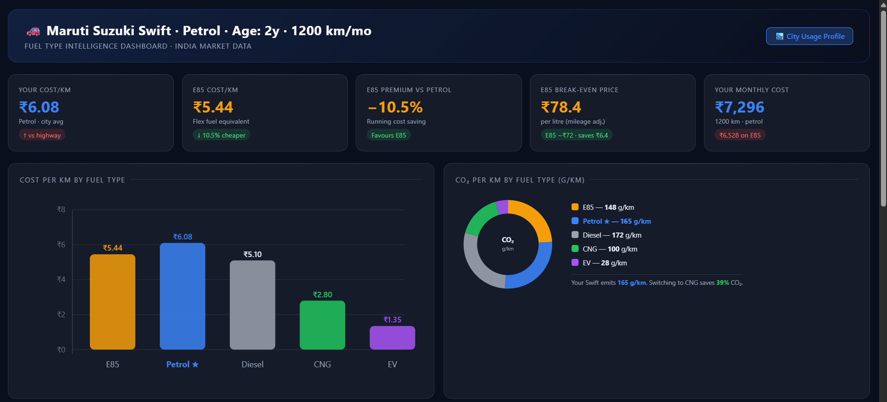
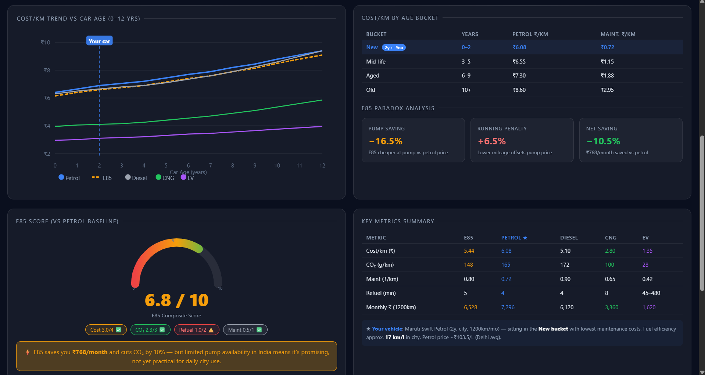
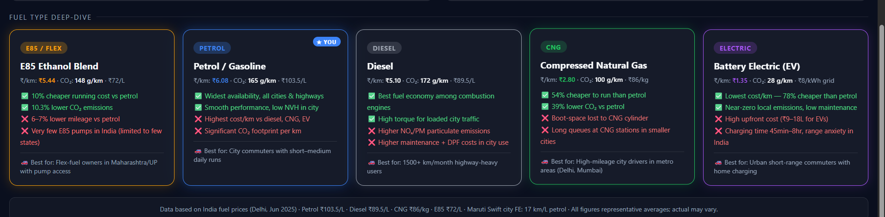

# Day 17 – AI Vehicle Cost & Fuel Analysis Dashboard

## Overview

For Day 17 of the #60DayClaudeChallenge, I built an AI-powered Vehicle Cost & Fuel Analysis Dashboard using Claude. The project involved analyzing a CSV dataset, calculating business metrics, generating visual insights, and creating an interactive HTML dashboard.

The goal was to transform raw vehicle data into meaningful insights using analytics and visualization techniques.

---

## Objective

Build a responsive HTML dashboard that:

* Reads and analyzes CSV data
* Calculates vehicle and fuel-related KPIs
* Compares fuel economics
* Visualizes maintenance and environmental impact
* Presents insights using SVG-based charts

---

## Vehicle Details

## Details
- Vehicle : Maruti Suzuki Swift
- Fuel    : Petrol
- Usage   : City
- KM/month: 1200
- Car Age : 2 yrs

## Role
Data analyst. Read attached CSV → compute metrics → output one HTML dashboard. HTML only, no explanation.

## Compute (group by Fuel_Type)
1. Avg Cost/km        = Fuel_Cost_INR ÷ Distance_km
2. Avg CO₂/km         = CO2_emitted_kg ÷ Distance_km
3. Avg Maintenance/km = Maintenance_Cost_INR ÷ Distance_km
4. Avg Refuel time    = Refuel_Recharge_time_min
5. Age buckets: New(0-2y) Mid-life(3-5y) Aged(6-9y) Old(10+y)
   → show Cost/km and Maint/km per bucket. Mark [CAR AGE] yrs.
6. E85 Paradox:
   - Pump saving    = ((Petrol_price−E85_price)/Petrol_price)×100
   - Running penalty= ((E85_cpkm−Petrol_cpkm)/Petrol_cpkm)×100
   - Break-even     = (E85_mileage÷Petrol_mileage)×Petrol_price
7. E85 Score/10: cost=4pt CO₂=3pt refuel=2pt maint=1pt

## Dashboard (no CDN, pure SVG charts, CSS in <style>, JS in <script>)
Dark navy #0a0f1e, glassmorphism. Colours: E85=amber Petrol=blue Diesel=grey CNG=green EV=purple.

1. Header — '[YOUR VEHICLE] · [FUEL] · Age:[CAR AGE]y · [KM/month]km/mo'
2. KPI Cards (5) — your fuel cost/km | E85 cost/km | E85 premium vs Petrol | break-even price | your monthly cost
3. SVG bar chart: Cost/km per fuel | SVG doughnut: CO₂/km per fuel (hover tooltips)
4. SVG line chart: Cost/km vs age (0-12y) per fuel. Vertical line at [CAR AGE].
5. SVG gauge: E85 score/10 (CSS animated). One verdict sentence.
6. Fuel cards: highlight [FUEL] with glow. Each: 2 pros ✅ 2 cons ❌ best-for 🚗

Output: <!DOCTYPE html> only. All numbers from CSV. Responsive 375px–1440px.
---

## Dashboard Features

### KPI Cards

* Cost per Kilometer
* Monthly Running Cost
* E85 Comparison
* Fuel Break-even Analysis
* Fuel Premium Comparison

### Visual Analytics

* Cost per KM (Bar Chart)
* CO₂ Emission Comparison (Doughnut Chart)
* Cost vs Vehicle Age (Line Chart)
* E85 Score Gauge
* Fuel Comparison Cards

### Technical Implementation

* HTML
* CSS
* JavaScript
* SVG Charts
* CSV Analysis with Claude

---

## Dashboard Screenshots

### Dashboard Overview

### KPI & Fuel Comparison

### Charts & Insights

---

## Key Insights

1. Lower fuel prices do not always result in lower overall operating costs.
2. Vehicle age significantly impacts maintenance cost per kilometer.
3. Visualization made cost and environmental comparisons easier to understand.
4. Fuel decisions become clearer when analyzing both efficiency and long-term expenses.
5. Dashboard metrics help convert raw data into actionable insights.

---

## Learnings

* Learned how AI can process structured CSV datasets.
* Understood KPI calculation and dashboard design.
* Practiced data storytelling through visualization.
* Explored cost, maintenance, and environmental analysis.
* Improved understanding of HTML-based analytics dashboards.

---
 
---

## Outcome

Successfully generated and reviewed a complete AI-driven Vehicle Cost & Fuel Analysis Dashboard and documented insights using GitHub.

#60DayClaudeChallenge
