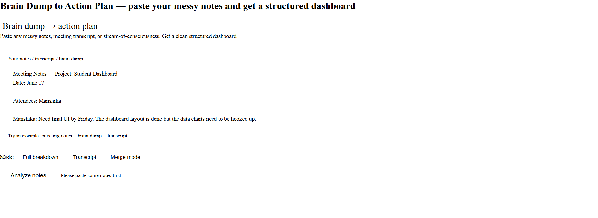
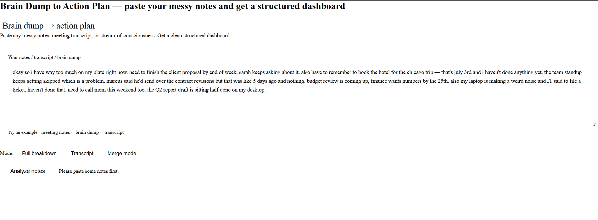
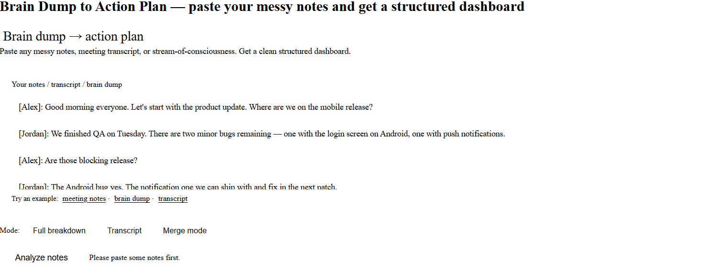

# Day 18 — Brain Dump Action Planner Skill

## Objective

Build a reusable Claude Custom Skill that converts messy notes into structured dashboards and actionable plans.

## Skill Name

brain-dump-action-planner

## What I Built

Created a reusable Claude Skill capable of transforming:

* Meeting Notes
* Brainstorming Sessions
* Voice Memo Transcripts
* Class Notes
* Project Discussions

into structured dashboards.

## Workflow Followed

1. Opened Claude
2. Navigated to Skills
3. Created new Custom Skill
4. Added description and instructions
5. Saved the skill
6. Tested using sample notes
7. Generated interactive dashboard
8. Reviewed action items and blockers
9. Captured screenshots
10. Uploaded to GitHub

## Screenshots

 

### Generated Dashboard

### Action Items

### Input Notes

## Key Learnings

* Custom Skills eliminate repetitive prompting.
* Unstructured information can become reusable workflows.
* Dashboard-style outputs improve decision tracking.
* Structured action planning saves time.

## Insight

The biggest value came from converting scattered notes into clear action items and identifying blockers automatically.

## Deliverable

GitHub Commit URL:
(Add after commit)
