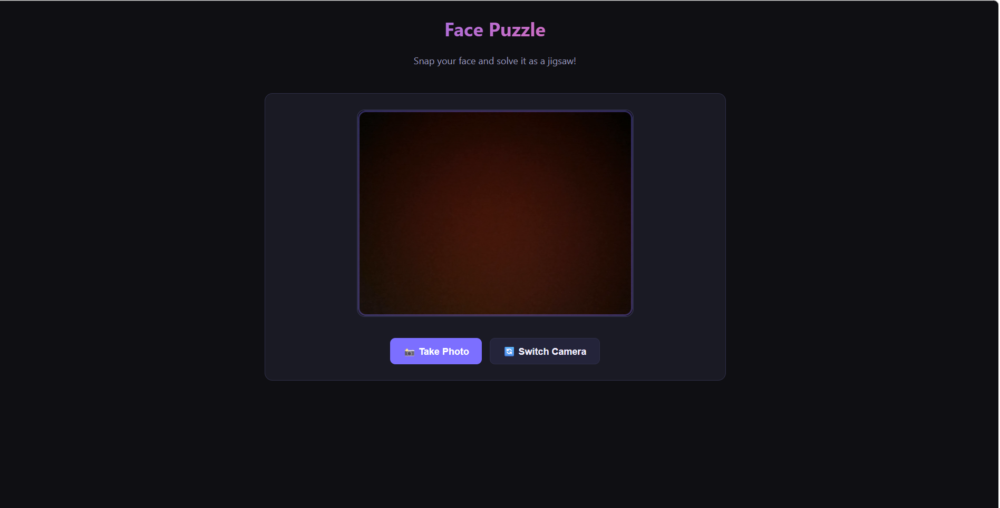
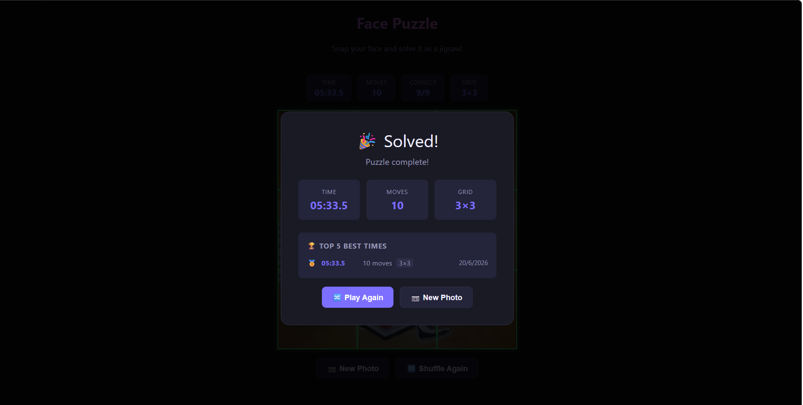

# Day 20 — Build a Face Puzzle Game with Camera Integration

## Overview

For Day 20 of the ABTalks 60-Day Coding Challenge, I built an interactive **Face Puzzle Game** using browser technologies. The application captures a live image through the webcam, converts it into puzzle pieces, and allows users to solve the shuffled puzzle using drag-and-drop and touch interactions.

This challenge focused on combining front-end development, browser APIs, image processing, game logic, and responsive UI design into a complete single-file application.

---

## Objective

Create a fully functional browser-based puzzle game that:

* Captures a user photo using webcam access
* Generates puzzle pieces dynamically
* Supports multiple difficulty levels
* Includes drag-and-drop and touch controls
* Tracks gameplay statistics
* Stores leaderboard results locally

---

## Technologies Used

* HTML5
* CSS3
* Vanilla JavaScript
* Canvas API
* MediaDevices API (`getUserMedia`)
* LocalStorage

---

## Features Implemented

### 📷 Camera Access

* Requested webcam permission on application load
* Displayed a live camera preview
* Captured a user photo using a snapshot feature

### 🧩 Puzzle Generation

* Converted the captured image into puzzle pieces
* Supported:

  * 3×3 Grid
  * 4×4 Grid
  * 5×5 Grid
* Randomized tile placement while maintaining solvability

### 🖱 Drag & Touch Controls

* Desktop drag-and-drop support
* Mobile touch gesture support
* Snap-to-grid movement
* Active drag highlighting
* Correct placement indicators

### ⏱ Game Tracking

* Real-time timer
* Move counter
* Correct tile progress tracker

### 🏆 Results System

* Automatic completion detection
* Final performance summary
* Local leaderboard (Top 5 scores)
* Saved:

  * Completion time
  * Moves
  * Difficulty
  * Date

### 🎨 UI Improvements

* Responsive design
* Retake Photo button
* Play Again functionality
* New Photo workflow
* Modern layout

---

## Development Process

### Step 1 — Generate Application

Opened Claude and provided the Face Puzzle Game prompt.

### Step 2 — Build HTML Application

Generated a complete single-file HTML application with inline CSS and JavaScript.

### Step 3 — Run Locally

Saved the generated file and opened it in the browser.

### Step 4 — Camera Testing

Allowed webcam permissions and verified image capture.

### Step 5 — Gameplay Testing

Tested:

* Puzzle creation
* Difficulty switching
* Drag interactions
* Touch gestures
* Move counting
* Timer updates

### Step 6 — Result Validation

Completed the puzzle and verified:

* Win detection
* Leaderboard saving
* Final result display

### Step 7 — Documentation

Captured screenshots and uploaded all files to GitHub.

---

## Screenshots

Add screenshots in this section.

### Camera Preview

### Results Screen

---

## Project Structure

Day20/
│
├── face-puzzle-game.html
├── day20.md
├── screenshots/
│ ├── camera-preview.png
│ ├── puzzle-board.png
│ ├── gameplay.png
│ └── results.png

---

## Learnings

This project helped me understand:

* Browser camera integration
* Working with Canvas for image slicing
* Implementing solvable puzzle algorithms
* Handling touch interactions
* Managing timers and state
* Using LocalStorage for persistent records
* Building responsive game interfaces

---

## Challenges Faced

* Handling camera permissions across browsers
* Managing drag behavior on mobile devices
* Ensuring puzzle solvability
* Keeping UI responsive during gameplay

---

## Outcome

Successfully built and tested a browser-based Face Puzzle Game that transforms a live camera photo into an interactive puzzle experience.

Completed Day 20 of the ABTalks 60-Day Coding Challenge.

 