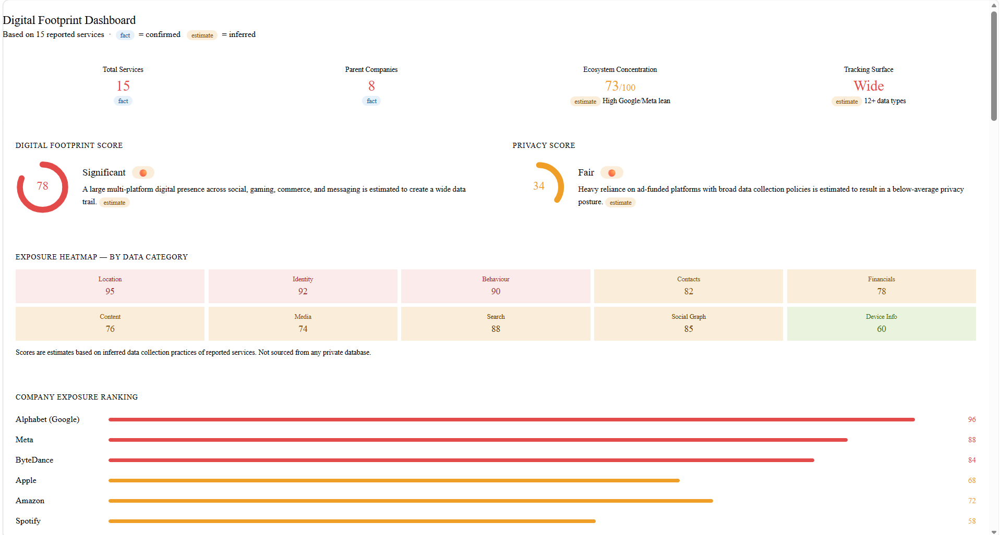
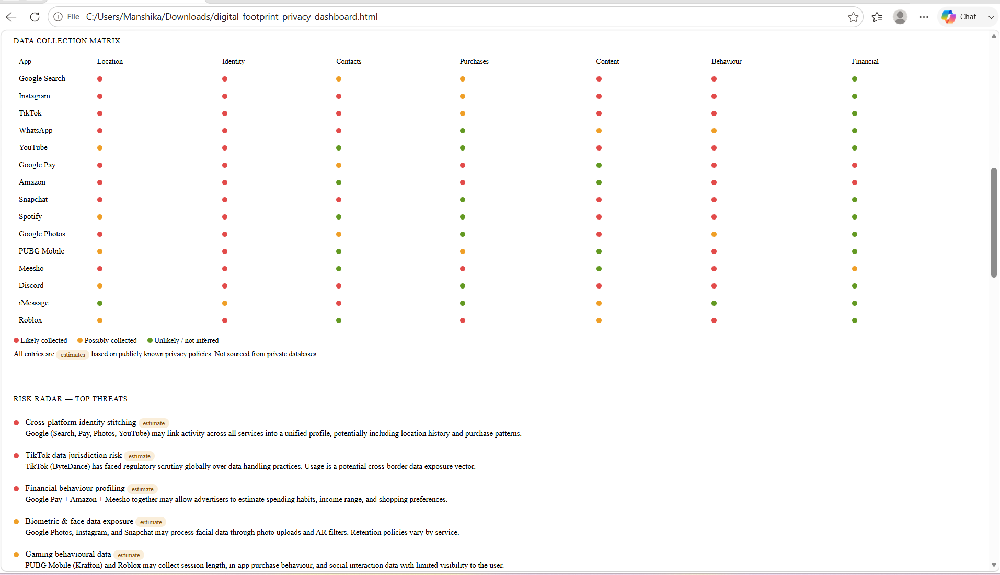
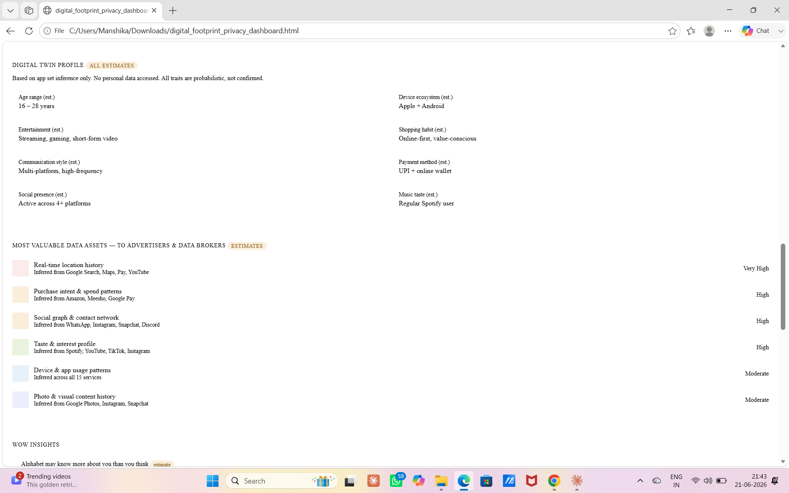
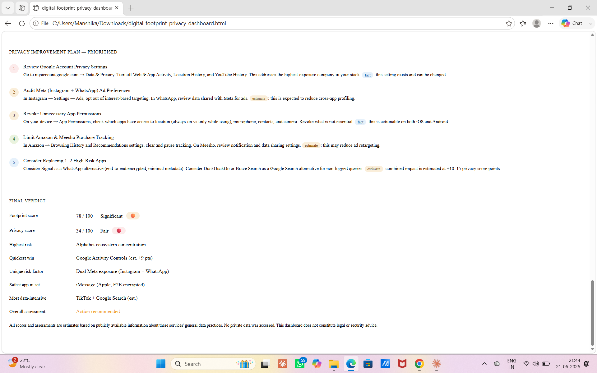

# Day 21 — Digital Privacy Intelligence Dashboard

## Challenge

Build a Digital Privacy Intelligence Dashboard using Claude.

## Objective

Analyze a sample digital footprint dataset and generate an interactive HTML dashboard to visualize privacy exposure, tracking surface, ecosystem concentration, and improvement opportunities.

---

## Tools Used

* Claude
* HTML
* CSS
* JavaScript
* GitHub

---

## Dataset Used

Applications:

* Instagram
* Snapchat
* TikTok
* YouTube
* Discord
* WhatsApp
* iMessage
* Spotify
* Roblox
* PUBG Mobile
* Amazon
* Meesho
* Google Search
* Google Pay
* Google Photos

---

## Dashboard Features

* Digital Footprint Score
* Privacy Score
* Exposure Heatmap
* Company Exposure Ranking
* Data Collection Matrix
* Risk Radar
* Digital Twin Profile
* Most Valuable Data Assets
* Privacy Improvement Simulator
* Final Verdict

---

## Dashboard Screenshots

### Dashboard Overview

### Digital Footprint Score

### Exposure Heatmap

### Risk Radar

 

### Facts

* Total services analyzed: 15
* Multiple parent ecosystems identified
* Cross-platform data exposure estimated

### Estimates

* Behavioral patterns may be inferred from app categories
* Entertainment and shopping interests could contribute to profiling
* Tracking surface may increase with ecosystem overlap

---

## Risk Analysis

* Medium–High ecosystem concentration
* Moderate privacy resilience
* Cross-service identity linking possible
* Exposure increases when multiple platforms belong to the same company

---

## Key Learnings

1. Digital footprints extend across services and parent companies.
2. Privacy is affected by ecosystem concentration.
3. Data minimization can reduce exposure.
4. Privacy dashboards help visualize hidden risk patterns.

---
 
