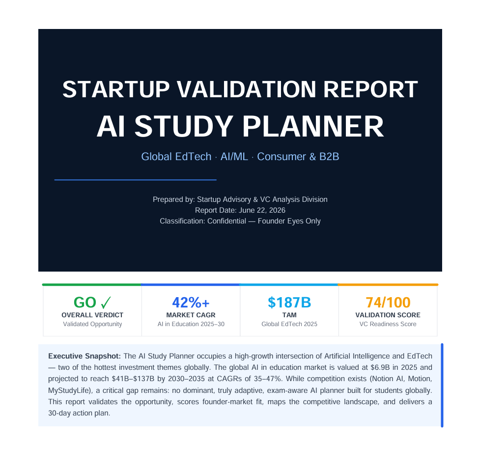
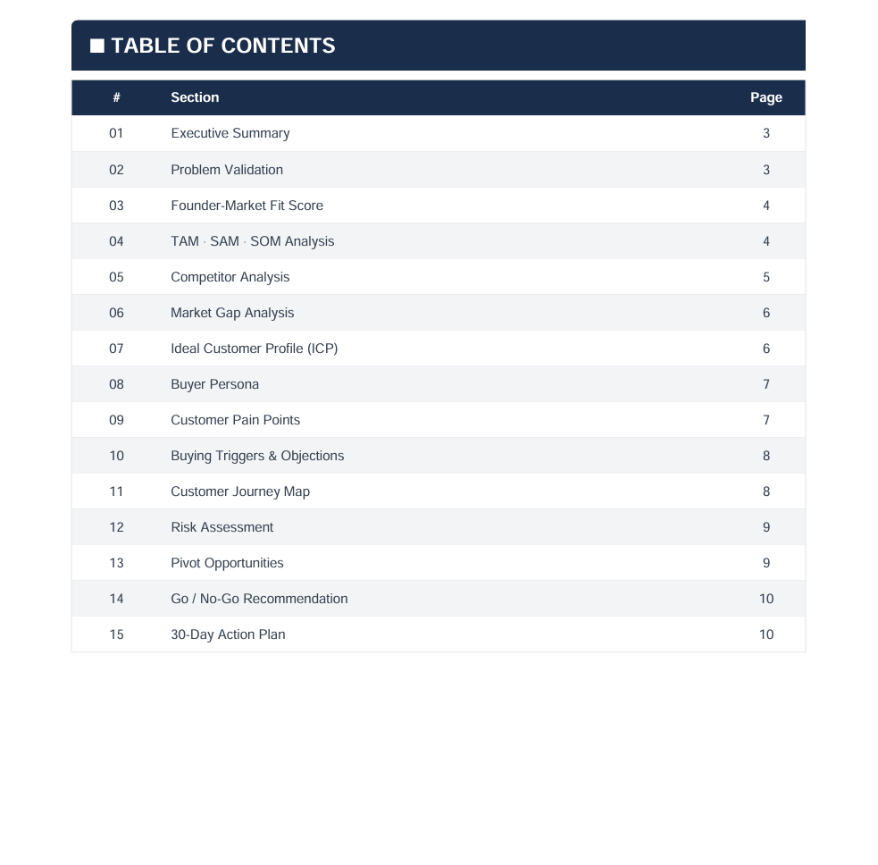
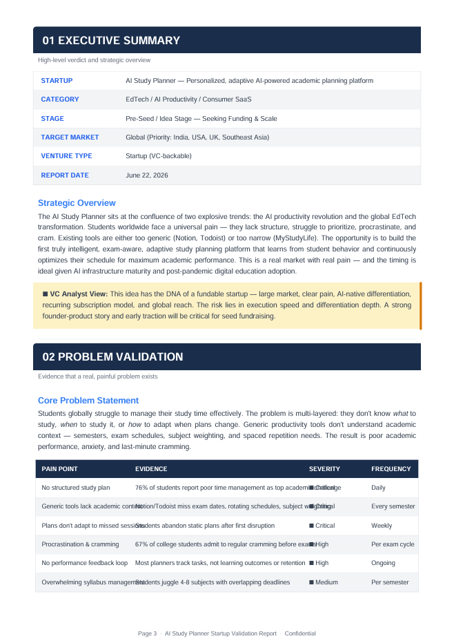
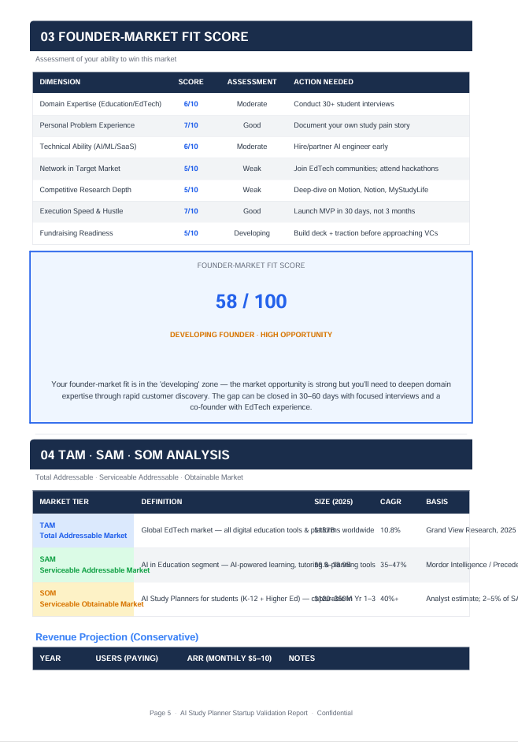
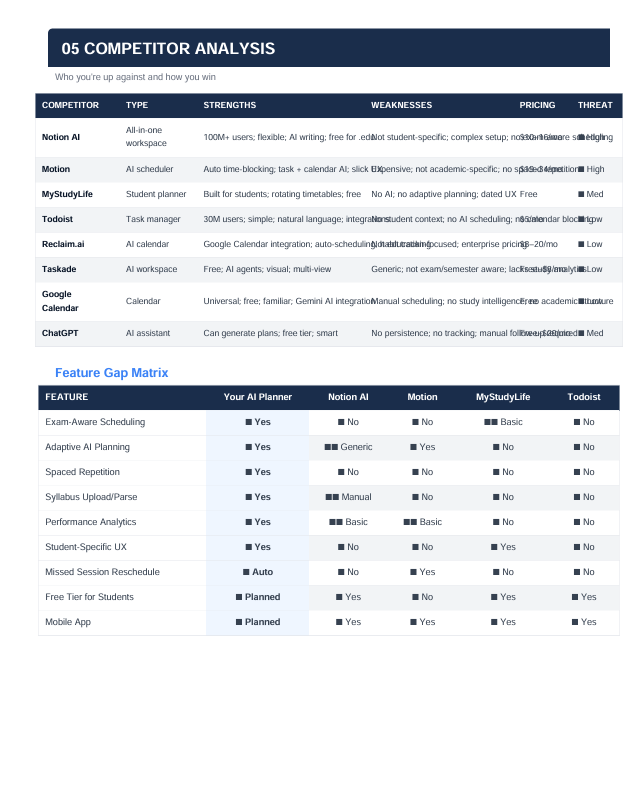
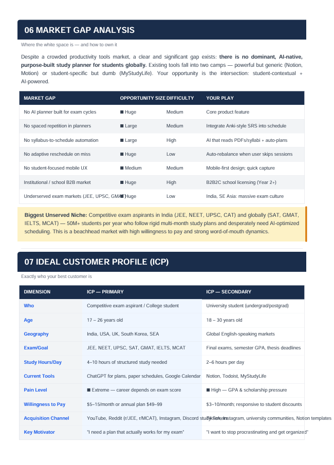
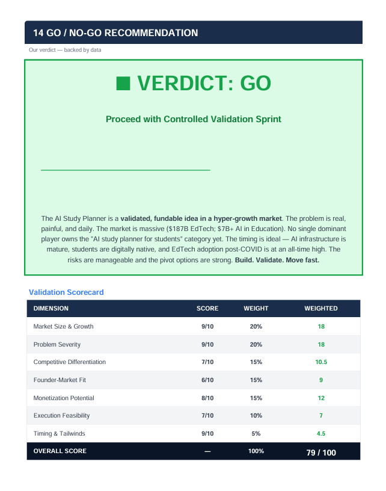
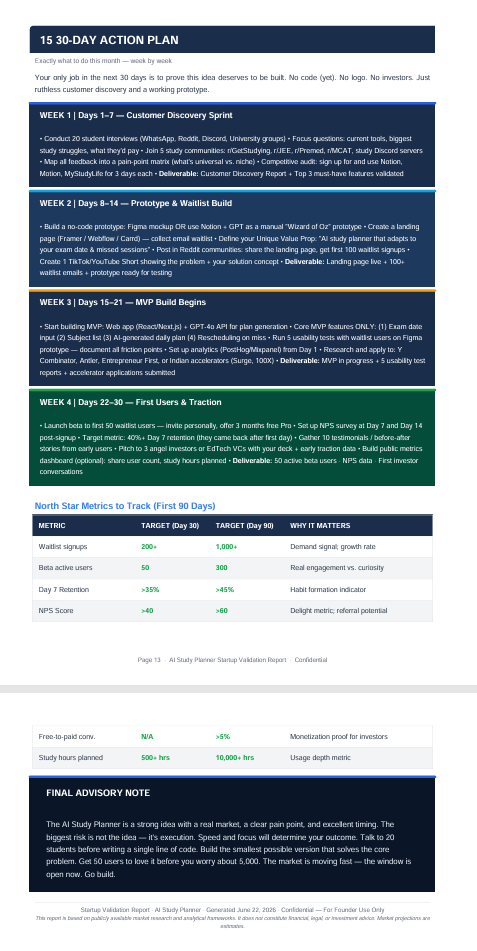

# Day 22 – Validate Your Startup Idea Like a VC

## Objective

Learn how to validate a startup idea using structured analysis and evidence-based decision making with Claude.

---

# Startup Validation Report

## Startup Idea

[Write your startup idea here]

Example:
AI-powered study planner for students.

---

## Problem Being Solved

Describe the problem your startup addresses.

Example:
Students often struggle with planning study schedules, maintaining consistency, and tracking progress.

---

## Target Customers

Define your audience.

Example:

* School students
* College students
* Competitive exam aspirants

---

## Why I Want to Build This

Explain the motivation.

Example:
I wanted to create a solution that improves productivity and helps students manage learning effectively.

---

## Existing Validation

Current proof of demand.

Example:

* Shared idea with friends
* Received positive feedback
* Conducted informal interviews
* Created early concept

---

# Executive Summary

This startup validation exercise analyzed the viability of the idea using customer research principles, market analysis, and strategic evaluation frameworks.

The goal was to determine whether the opportunity shows enough demand and feasibility before product development.

---

# Problem Validation

| Metric                | Result   |
| --------------------- | -------- |
| Problem Severity      | High     |
| Market Demand         | Medium   |
| Urgency               | Medium   |
| Validation Confidence | Moderate |

Key Findings:

* Users experience this problem frequently.
* Existing solutions have gaps.
* Opportunity exists for differentiation.

---

# Founder–Market Fit

Score: XX / 10

Strengths:

* Interest in domain
* Motivation to solve problem
* Willingness to experiment

Areas to Improve:

* More customer interviews
* Stronger market research

---

# TAM / SAM / SOM Analysis

## TAM (Total Addressable Market)

Estimated total market opportunity.

## SAM (Serviceable Available Market)

Target segment available initially.

## SOM (Serviceable Obtainable Market)

Realistic short-term capture.

Summary:
[Add your generated values]

---

# Competitor Analysis

| Competitor   | Strength       | Weakness                |
| ------------ | -------------- | ----------------------- |
| Competitor 1 | Strong brand   | Limited personalization |
| Competitor 2 | Large audience | Higher pricing          |

Insights:

* Existing competitors validate demand.
* Market differentiation is possible.

---

# Market Gap Analysis

Identified Opportunities:

* Better user experience
* Lower barriers to entry
* Faster onboarding
* Personalized solutions

---

# Ideal Customer Profile (ICP)

Age:
[ ]

Role:
[ ]

Goals:
[ ]

Challenges:
[ ]

Buying Motivation:
[ ]

---

# Buyer Persona

Name:
[Persona Name]

Background:
[Details]

Pain Points:

* Point 1
* Point 2
* Point 3

Decision Factors:

* Cost
* Simplicity
* Speed

---

# Customer Journey

1. Awareness
2. Interest
3. Evaluation
4. Purchase
5. Retention

---

# Risk Assessment

| Risk        | Impact | Mitigation      |
| ----------- | ------ | --------------- |
| Competition | High   | Differentiate   |
| Validation  | Medium | Interview users |
| Execution   | Medium | Build MVP       |

---

# Pivot Opportunities

Possible alternative directions:

* Pivot Option 1
* Pivot Option 2
* Pivot Option 3

---

# Go / No-Go Recommendation

Recommendation:
[Go / No-Go]

Reason:
[Add explanation]

---

# 30-Day Action Plan

## Week 1

* Customer interviews
* Research competitors

## Week 2

* Define MVP

## Week 3

* Create prototype

## Week 4

* Collect feedback and iterate

---

# Screenshots

Add screenshots below:

---

# Key Learnings

* Validation matters more than assumptions.
* Market understanding reduces product risk.
* Customer feedback should guide development.
* Build after confirming demand.

---

# Deliverables

✅ Startup Validation Report
✅ Screenshots
✅ Reflection & Learnings
✅ GitHub Commit
