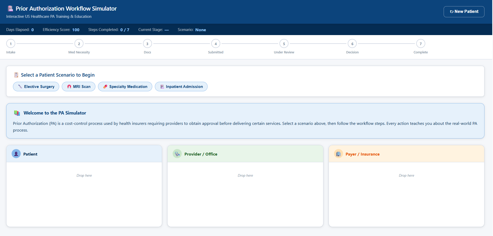
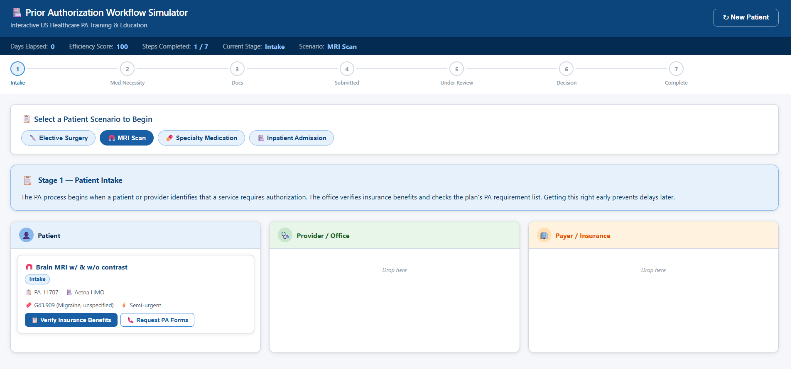

# Day 26 – Business Workflow Simulation with Claude

## 📌 Project Title

**Prior Authorization Workflow Simulator**

## 🎯 Objective

Built an interactive Prior Authorization Workflow Simulator that demonstrates the US healthcare prior authorization process through a gamified drag-and-drop interface. The simulator helps users understand how patients, providers, and payers interact during the authorization workflow.

---

## 🚀 Features

* Interactive drag-and-drop workflow
* Three workflow lanes:

  * Patient
  * Provider
  * Payer
* Multiple patient scenarios:

  * Elective Surgery
  * MRI
  * Specialty Medication
  * Inpatient Admission
* Medical Necessity Evaluation
* Prior Authorization document collection
* Submission to payer
* Multiple review outcomes:

  * Approval
  * Pend
  * Denial
  * Appeal
  * Peer-to-Peer Review
* Educational explanation after every workflow step
* Progress tracker
* Days elapsed counter
* Efficiency score
* Celebration animation on approval
* Workflow summary
* Restart / New Patient functionality
* Responsive modern UI
* Built using HTML, CSS, and Vanilla JavaScript

---

## 🛠️ Technologies Used

* HTML5
* CSS3
* Vanilla JavaScript

---

## 📸 Screenshots

### Home Screen

### Patient Workflow

 
---

## 📚 What I Learned

* Gained an understanding of the US healthcare Prior Authorization workflow.
* Learned how providers prepare and submit authorization requests.
* Explored payer review outcomes including approval, pend, denial, appeals, and peer-to-peer review.
* Improved my knowledge of workflow simulation using JavaScript.
* Practiced building drag-and-drop interactions without external libraries.
* Enhanced UI design skills for creating responsive, interactive applications.

---

 
## 🎯 Outcome

Successfully developed a single-file interactive Prior Authorization Workflow Simulator that models a real-world healthcare process with engaging gameplay, educational insights, progress tracking, and multiple workflow outcomes.

---

**#ABTalks #60DayCodingChallenge #Day26 #ClaudeAI #HealthcareTech #WorkflowSimulation #HTML #CSS #JavaScript #LearningInPublic**
