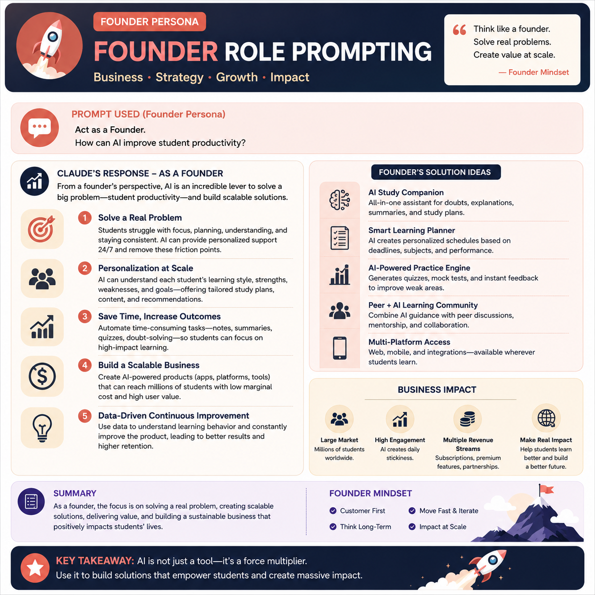
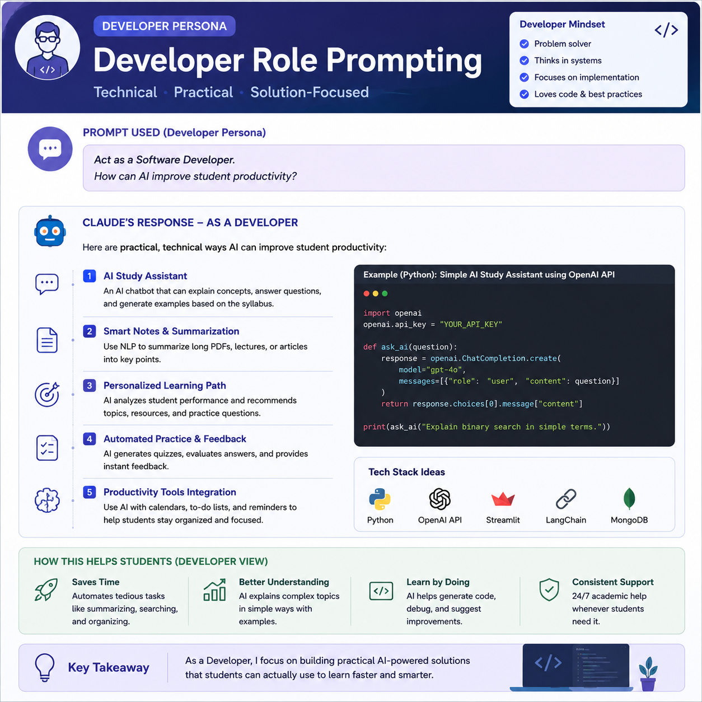
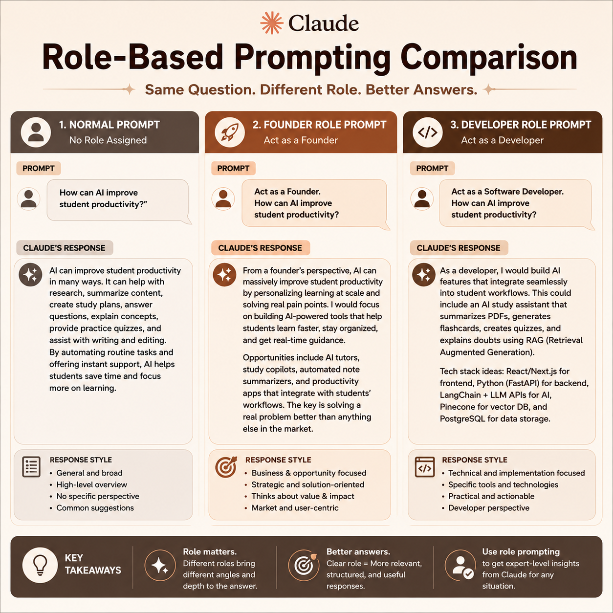
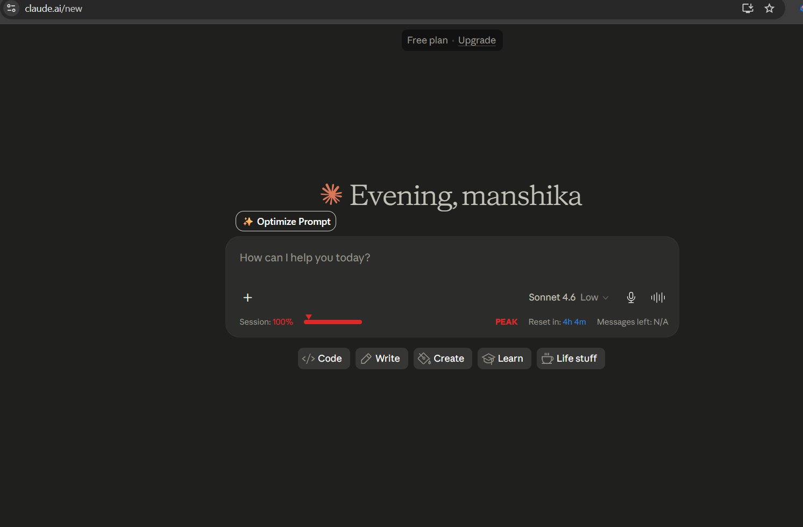

# Day 3 – Role-Based Prompting

## Objective

The objective of this task was to understand how Role-Based Prompting influences the quality and perspective of AI-generated responses. I explored how assigning different roles to Claude changes the style, depth, and focus of its answers.

---

# What is Role-Based Prompting?

Role-Based Prompting is a prompt engineering technique where we assign a specific role or persona to the AI before asking a question.

Instead of asking a question directly, we tell the AI who it should act as, such as:

* Founder
* Software Developer
* Product Manager
* HR Manager
* Marketer

This helps the AI provide responses from a specific perspective and produce more relevant and specialized answers.

---

# Question Used

How can AI improve student productivity?

---

# Prompt 1 – Without Any Role

## Prompt

How can AI improve student productivity?

## Output Summary

AI can improve student productivity by helping students research information faster, summarize notes, create study plans, answer questions, explain concepts, and automate repetitive tasks. It helps students save time and stay organized.

## Screenshot

---

# Prompt 2 – Founder Persona

## Prompt

Act as a Founder.

How can AI improve student productivity?

## Output Summary

From a founder's perspective, AI can improve student productivity by solving student problems at scale. AI-powered platforms can provide personalized learning, performance tracking, smart scheduling, and instant doubt-solving. The focus is on creating value, scalability, and impact.

## Screenshot

---

# Prompt 3 – Developer Persona

## Prompt

Act as a Software Developer.

How can AI improve student productivity?

## Output Summary

From a developer's perspective, AI can improve student productivity by building intelligent tools such as AI study assistants, note summarizers, quiz generators, personalized learning systems, and productivity applications. The focus is on technical implementation and solution development.

## Screenshot

---

# Comparison

| Prompt Type | Response Style                               |
| ----------- | -------------------------------------------- |
| No Role     | General and broad explanation                |
| Founder     | Business-oriented and focused on scalability |
| Developer   | Technical and implementation-focused         |

---

# Claude Usage Counter

## Purpose

Claude Usage Counter helps users monitor:

* Message consumption
* Estimated usage limits
* Remaining quota
* Real-time usage statistics

## Screenshot

---

# Key Learnings

1. Assigning a role significantly changes the AI's response style.
2. Founder prompts generate business-focused insights.
3. Developer prompts generate technical and implementation-focused answers.
4. Better context leads to better outputs.
5. Role-Based Prompting is a powerful prompt engineering technique.
6. Claude Usage Counter helps track AI usage efficiently.

---

# Conclusion

This experiment demonstrated that Role-Based Prompting improves the relevance and quality of AI responses. The same question can produce completely different perspectives depending on the assigned role. By providing clear context through personas, users can obtain more accurate, useful, and expert-level answers from AI systems like Claude.
