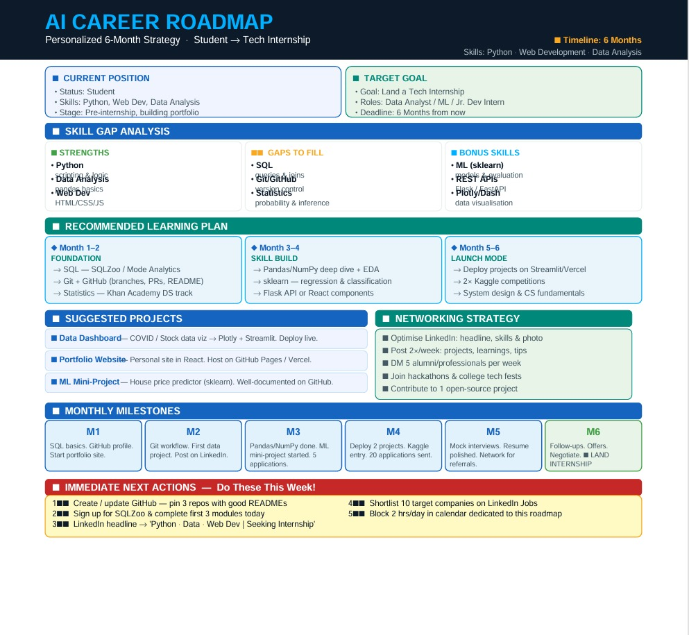

# Day 4 – Chain-of-Thought Prompting using Capsule Hub

## Objective

The objective of this activity was to explore Chain-of-Thought Prompting and generate a structured AI-powered career roadmap based on current skills, interests, and career goals.

---

## Tools Used

* Claude AI
* Capsule Hub
* GitHub
* VS Code

---

## About Chain-of-Thought Prompting

Chain-of-Thought Prompting helps AI break complex goals into smaller actionable steps and provide more organized and personalized outputs.

---

## My Profile

### Current Position

* Status: Student
* Skills: Python, Web Development, Data Analysis
* Stage: Pre-internship, building portfolio

### Target Goal

Land a Tech Internship within the next 6 months.

Target Roles:

* Data Analyst Intern
* Machine Learning Intern
* Junior Developer Intern

---

## Skill Gap Analysis

### Existing Strengths

* Python fundamentals
* Data Analysis basics
* Web Development (HTML/CSS/JS)

### Areas to Improve

* SQL
* Git & GitHub workflow
* Statistics

### Bonus Skills

* Machine Learning (Sklearn)
* REST APIs
* Data Visualization

---

## Recommended Learning Plan

### Month 1–2 → Foundation

* Learn SQL basics and queries
* Improve Git & GitHub workflow
* Strengthen statistics concepts

### Month 3–4 → Skill Building

* Practice Pandas and NumPy
* Build EDA projects
* Learn Flask API development

### Month 5–6 → Launch Mode

* Deploy projects online
* Participate in competitions
* Prepare for internship applications

---

## Suggested Projects

1. Data Dashboard
2. Portfolio Website
3. Machine Learning Mini Project

---

## Networking Strategy

* Improve LinkedIn profile
* Post projects regularly
* Connect with professionals
* Participate in hackathons
* Contribute to open source

---

## Monthly Milestones

### Month 1

Complete SQL basics and improve GitHub.

### Month 2

Build first complete project.

### Month 3

Finish Pandas and NumPy.

### Month 4

Deploy two projects.

### Month 5

Prepare resume and interviews.

### Month 6

Apply and secure internship opportunities.

---

## Immediate Next Actions

* Update GitHub profile
* Complete SQLZoo modules
* Improve LinkedIn headline
* Shortlist target companies
* Reserve daily learning hours

---

## Biggest Insight

I learned that achieving a tech internship is easier when skills are developed in stages with measurable milestones instead of learning randomly.

---

## Learnings

* Learned structured prompting techniques
* Understood career planning through AI
* Explored Capsule Hub workflow organization
* Improved roadmap thinking

---

## Screenshots

### AI Career Roadmap

Place screenshot in Day4 folder and keep filename:

```md

```

---

## Conclusion

This activity showed how Chain-of-Thought Prompting can transform broad goals into practical learning plans and provide a clear roadmap toward career growth.
