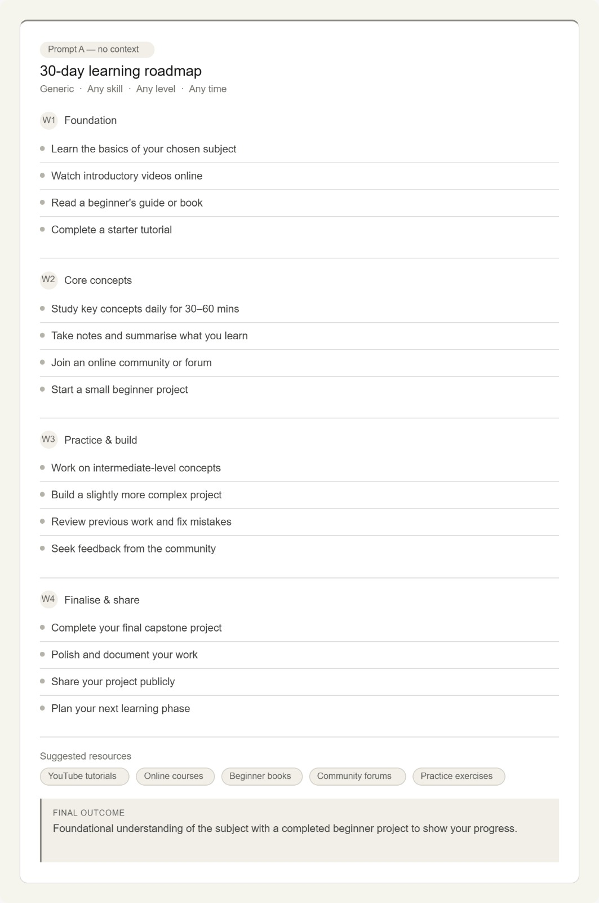
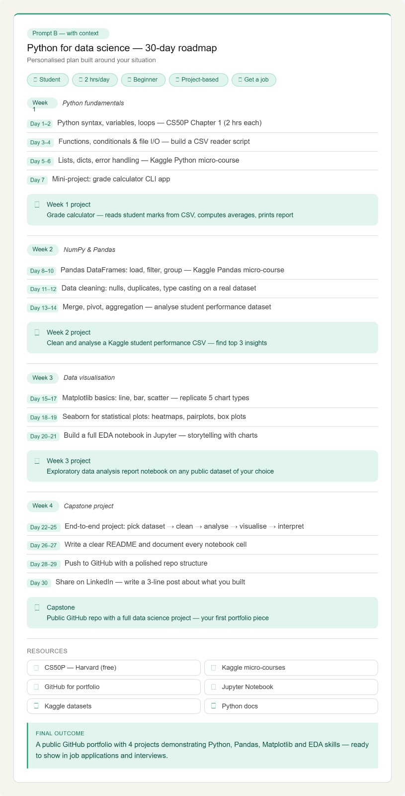
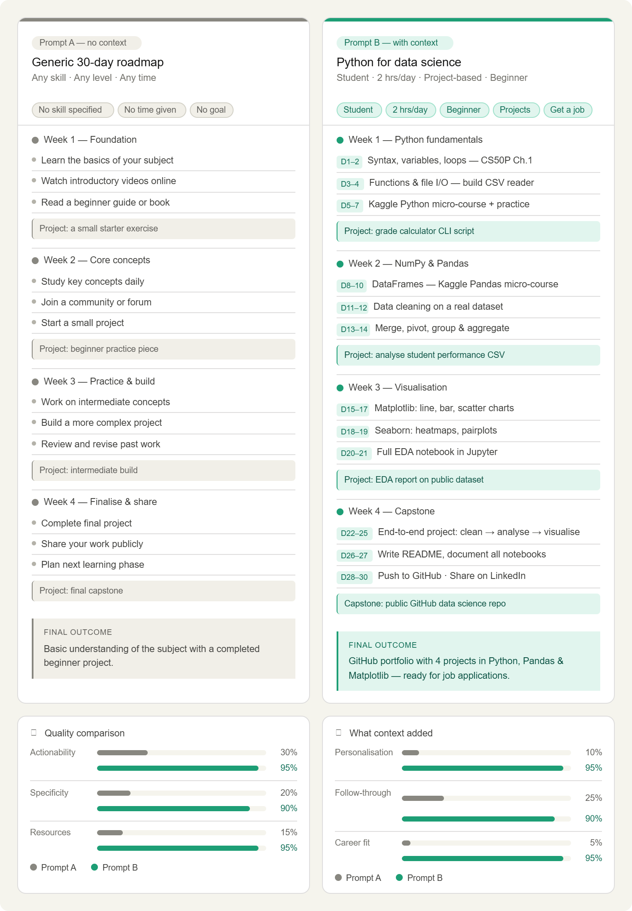

# Day 5 – Context Engineering with Claude

## Introduction

Today’s challenge focused on understanding **Context Engineering** and how it improves AI-generated responses.

The goal was to compare two outputs:

* A **generic response** generated from Prompt A
* A **personalized response** generated from Prompt B using my own background, interests, and goals

This experiment showed how adding context can transform AI output from broad suggestions into meaningful and personalized guidance.

---

# Task Overview

For this challenge, I:

✔ Installed and explored Sider AI
✔ Read the provided Context Engineering resources
✔ Generated output using Prompt A
✔ Generated another output using Prompt B with personal details
✔ Compared both outputs
✔ Documented observations and learnings

---

# Prompt A – Generic Roadmap

## Description

Prompt A was used without personal information.

The purpose was to observe how AI responds with minimal context.

## Output

Prompt A produces a roadmap that's technically complete but practically useless — it could apply to learning guitar, cooking, or coding. Nothing about it tells you what to open tomorrow morning.

---

## Screenshot

---

# Prompt B – Personalized Roadmap

## Description

Prompt B included personal information to generate a more customized learning roadmap.

### Profile Used

**Name:** Manshika
**Education:** B.Tech Student

### Current Skills

* Basic Python
* Java
* Networking
* Cybersecurity Fundamentals

### Interests

* Data Science
* Data Analytics
* Artificial Intelligence
* Machine Learning
* Open Source

### Goals

* Build strong foundations in Data Science and AI
* Improve analytical thinking
* Work on real-world projects
* Learn modern AI tools and technologies
* Become industry-ready

---

## Output

Prompt B produces a plan you can act on the same day. The six context variables do most of the heavy lifting:

Situation → sets the pace (student vs. professional has very different time pressures)
Current skills → prevents re-teaching what you already know
Goal → orients every resource and project toward a real outcome
Time available → makes daily tasks realistic, not aspirational
Level → calibrates difficulty so week 1 doesn't burn you out or bore you
Learning style → routes you toward videos vs. projects vs. reading so you're learning in your own mode

---

## Screenshot

---

# Comparison – Generic vs Personalized Output

| Category        | Prompt A | Prompt B   |
| --------------- | -------- | ---------- |
| Context         | Minimal  | Detailed   |
| Personalization | Generic  | High       |
| Recommendations | Broad    | Targeted   |
| Learning Path   | General  | Customized |
| Relevance       | Moderate | High       |

---

# Analysis

## Prompt A

The first output generated a roadmap suitable for a wide audience.

Characteristics:

* General learning suggestions
* No consideration of existing skills
* Less focused direction
* Useful but not personalized

---

## Prompt B

The second output was noticeably different.

Because context was provided, the AI created recommendations that aligned with my interests in Data Science and Artificial Intelligence.

Characteristics:

* Personalized roadmap
* More relevant recommendations
* Better alignment with goals
* Clear learning progression

---

# Biggest Difference Observed

The most noticeable difference was that Prompt B felt like guidance designed specifically for me.

Instead of generic recommendations, the AI considered:

* My current skills
* My interests
* My educational background
* My future goals

This resulted in a roadmap that was more practical and easier to follow.

---
s
# Key Learnings

Through this challenge, I learned:

* Context Engineering improves response quality.
* AI performs better with structured information.
* Personalized prompts create more useful outcomes.
* Better prompts lead to more actionable recommendations.
* Prompt design is an important skill for working with AI.

---

# Reflection

This challenge helped me understand that effective AI usage is not only about asking questions but also about providing meaningful context.

Adding background information transformed the output into something more accurate, relevant, and valuable.

This activity changed the way I think about prompt writing and showed the real impact of Context Engineering.

---

# Conclusion

Day 5 demonstrated how powerful Context Engineering can be.

Comparing generic and personalized outputs clearly showed that adding context helps AI generate smarter, more focused, and more useful responses.

This experience strengthened my understanding of AI prompting and how personalized inputs improve results.
