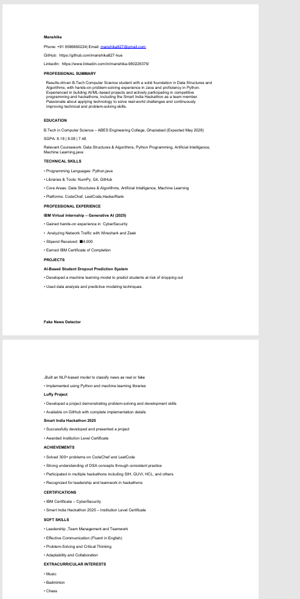
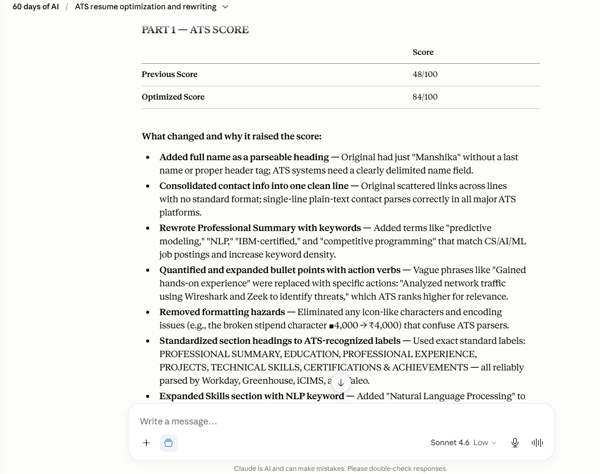
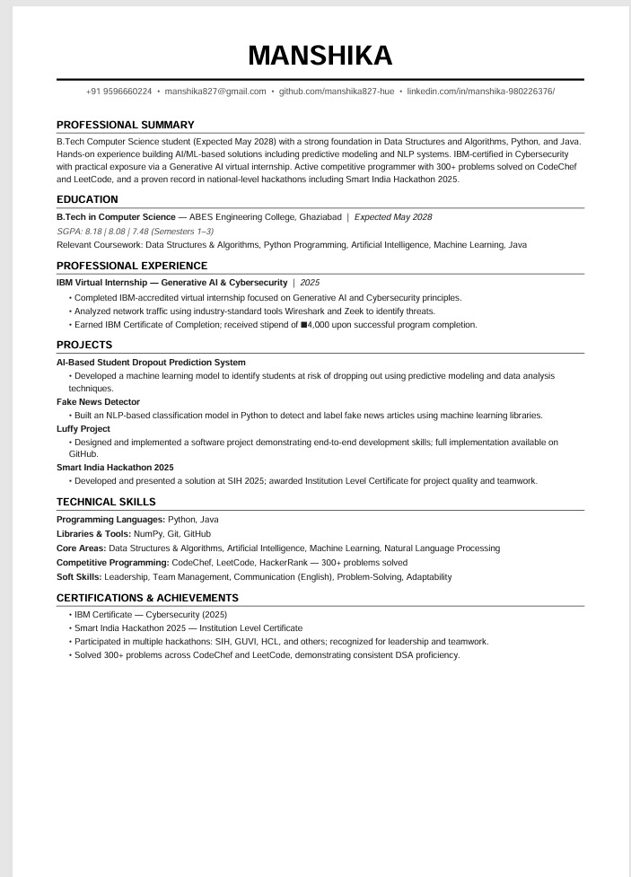
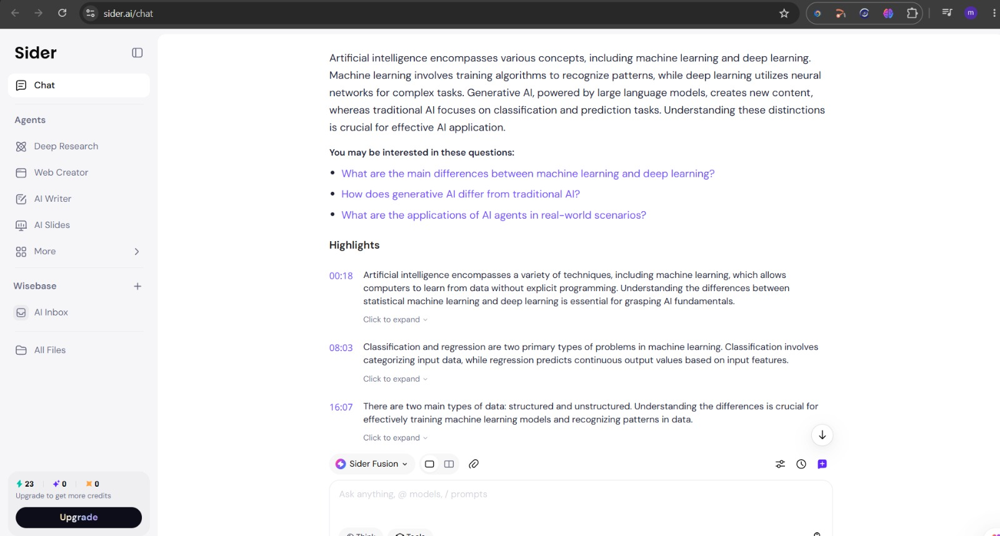

# Day 6 - Resume Optimization with Claude & AI Learning using NoteGPT

## Overview

Day 6 of the #60DayClaudeChallenge focused on two practical applications of Artificial Intelligence:

1. Resume Optimization using Claude AI
2. Learning Enhancement using NoteGPT

The goal was to understand how AI can improve professional documents for Applicant Tracking Systems (ATS) while also exploring AI-powered tools that simplify learning and content consumption.

---

## Tools Used

* Claude AI
* NoteGPT / Sider AI Extension
* GitHub
* VS Code
* Chrome Browser

---

## Task 1: Resume Optimization Using Claude

I uploaded my resume to Claude AI and used the provided ATS Optimization Prompt to analyze and improve its structure, readability, and ATS compatibility.

### ATS Analysis

Claude evaluated my resume and identified several areas for improvement:

* Better keyword optimization for ATS systems
* Improved section organization
* More impactful action verbs
* Enhanced project descriptions
* Cleaner formatting for recruiter readability
* Reduced redundancy and unnecessary content

### Improvements Made

* Added ATS-friendly keywords
* Improved project descriptions with clear outcomes
* Organized skills into a structured format
* Enhanced overall readability
* Optimized resume layout for one-page presentation
* Improved professional summary section

### ATS Score

The analysis demonstrated how AI can help increase the chances of passing ATS screening by making resumes more relevant and recruiter-friendly.

---

## Task 2: Learning with NoteGPT

I explored NoteGPT (Sider AI) to understand how AI can simplify learning from online educational content.

I used an AI-focused YouTube video and generated an automatic summary.

### Summary Highlights

The generated notes explained:

* Artificial Intelligence fundamentals
* Machine Learning concepts
* Deep Learning techniques
* Generative AI and Large Language Models
* Real-world AI applications

The tool also generated key highlights and suggested follow-up questions, helping me understand the content more efficiently.

---

## Screenshots

### Original Resume

### ATS Analysis

### Optimized Resume

### NoteGPT AI Summary

---

## Key Learnings

### Resume Optimization

* ATS systems prioritize keywords and formatting.
* Professional summaries improve recruiter engagement.
* Action verbs make project descriptions stronger.
* Structured resumes improve readability and ATS parsing.

### AI-Assisted Learning

* AI can summarize lengthy educational content instantly.
* Key highlights help in faster revision.
* AI-generated notes improve learning efficiency.
* Follow-up questions encourage deeper understanding.

---

## Challenges Faced

* Understanding ATS optimization requirements.
* Condensing information into a one-page resume.
* Selecting the most relevant skills and projects.
* Learning how to integrate AI tools effectively into daily workflows.

---

## Outcome

Successfully optimized my resume using Claude AI and explored AI-powered learning through NoteGPT. This activity demonstrated how Artificial Intelligence can enhance both professional development and knowledge acquisition.

Day 6 reinforced the importance of leveraging AI tools for productivity, career growth, and continuous learning.

---

## Conclusion

This exercise showed that AI is not only useful for generating content but also for improving professional documents and accelerating learning. By combining Claude's resume optimization capabilities with NoteGPT's summarization features, I gained practical experience in applying AI to real-world tasks.
