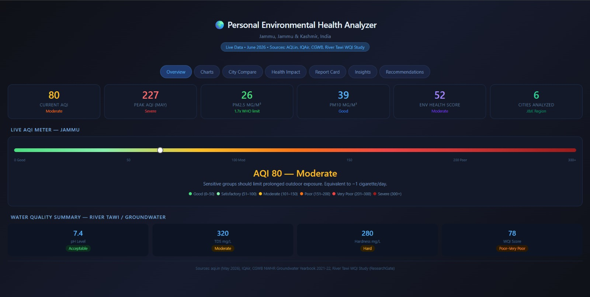
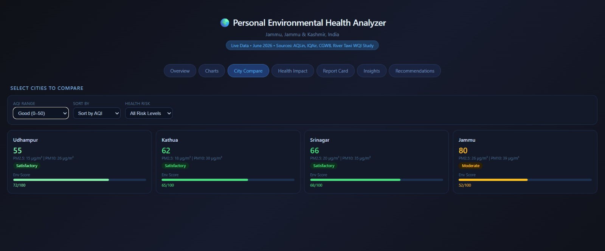
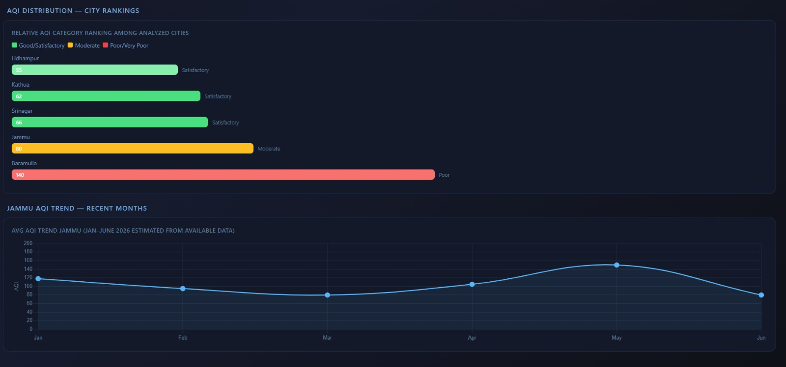
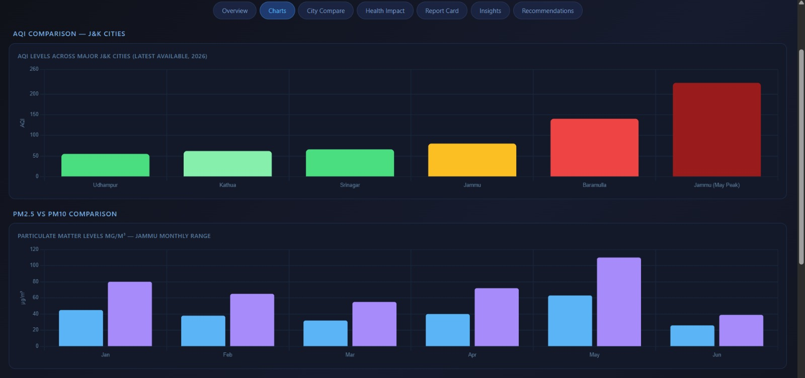
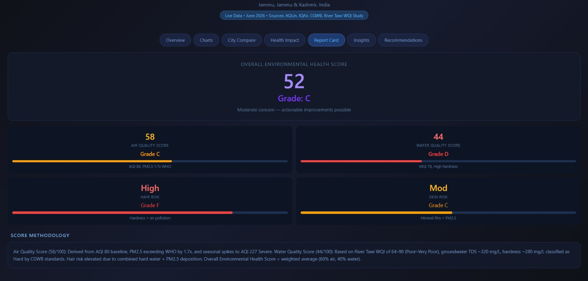

# Day 8 — Claude Artifacts: Personal Environmental Health Analyzer

## Overview

Today I explored Claude Artifacts and learned how AI can generate complete interactive applications instead of simple text responses.

The project focused on creating an Environmental Health Analyzer dashboard using AI-generated HTML and interactive visual components.

---

## Objective

Build an AI-powered dashboard that analyzes environmental health factors including Air Quality Index (AQI), pollution metrics, environmental scoring, and personalized recommendations.

---

## Dashboard Features

### Interactive Components

* AQI comparison dashboard
* PM2.5 and PM10 analysis
* Environmental score calculator
* City comparison filters
* Health risk indicators
* Interactive charts and visual cards
* Personalized recommendation engine

---

## Screenshots

### Dashboard Preview

### City Compare

### Charts

### Environmental Report

### Health Impact
s

---

## Generated Application

Included:

* index.html
* Responsive dashboard
* Interactive filters
* Data visualizations
* Health scoring system

---

## What I Learned

### 1. Claude Artifacts

Claude can generate applications instead of only text.

### 2. Dashboard Thinking

Learned how charts, filters, and reports combine into a usable product.

### 3. Prompt Engineering

Detailed prompts produce more complete outputs.

### 4. AI Product Development

A single prompt can become an interactive application.

---

## Most Surprising Insight

The most surprising part was seeing AI transform one prompt into a complete dashboard with analytics, visuals, and user interaction.

---

## Challenges Faced

* Understanding generated dashboard structure
* Testing interactions
* Organizing project files for GitHub

---

## Reflection

This challenge showed how AI tools can accelerate software creation and turn ideas into usable products quickly.

#60DayClaudeChallenge
#ClaudeArtifacts
#AI
#Dashboard
#ABTalks
