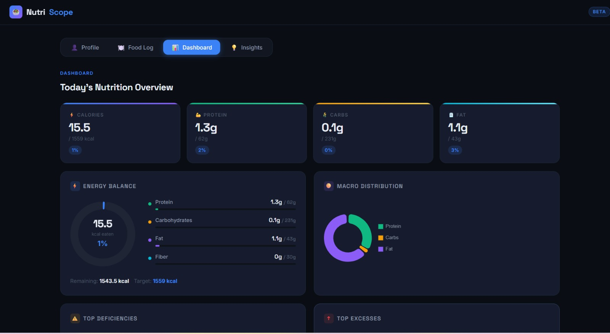
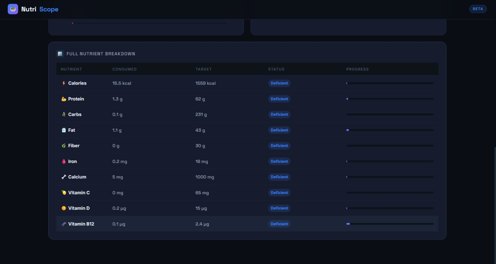
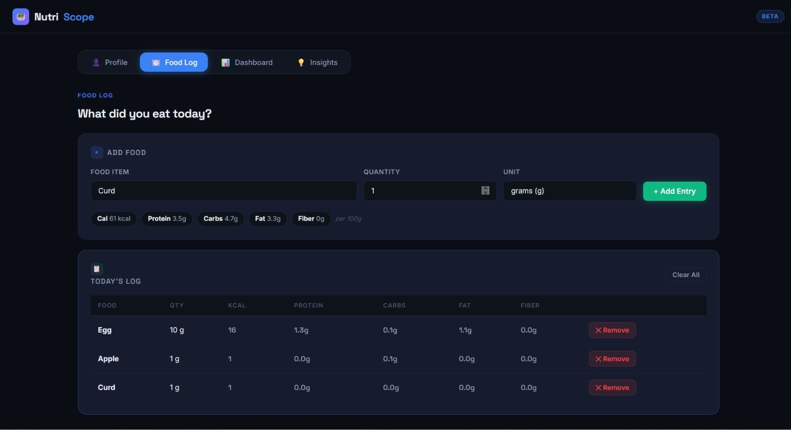
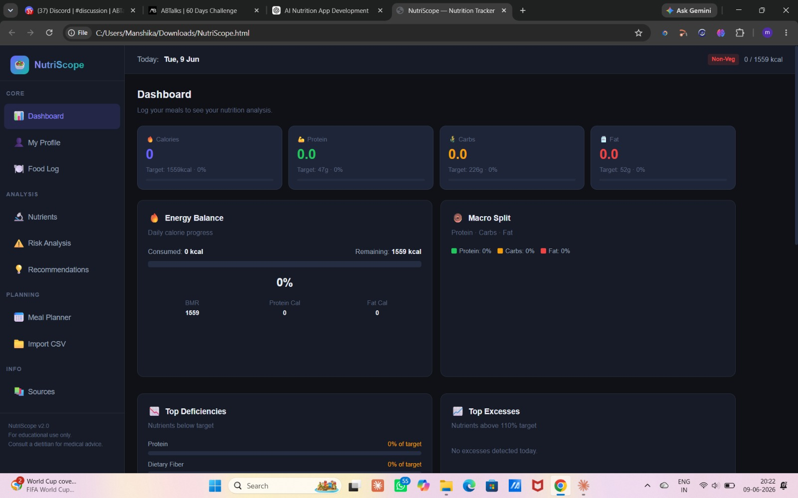
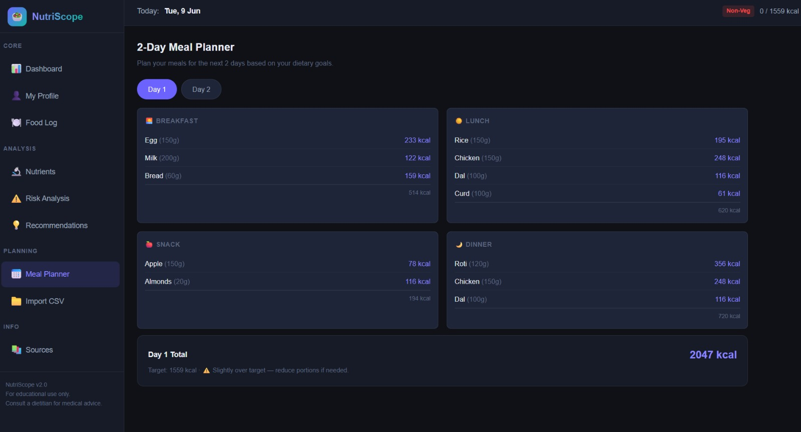
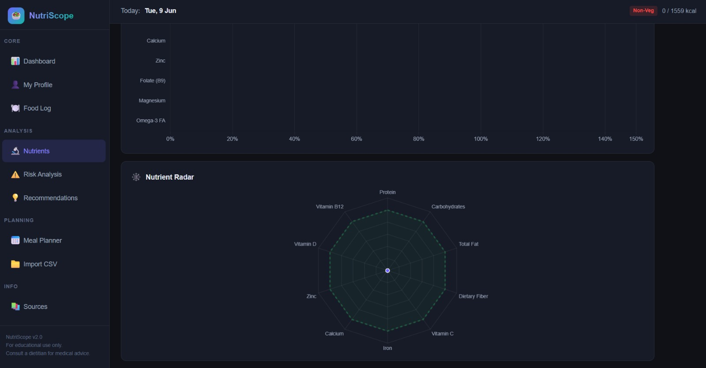

# Day 9 — Build & Enhance an AI Nutrition Analytics App (NutriScope)

## Objective

The goal of Day 9 was to learn iterative AI application development using Claude Artifacts by first creating an MVP (Minimum Viable Product) and then improving it into an enhanced version.

---

# Project: NutriScope

NutriScope is an AI-powered nutrition analytics web application built as a single HTML file.

The project was completed in two phases:

1. MVP Version (initial working product)
2. Enhanced Version (additional functionality and improvements)

---

# Tools Used

* Claude Artifacts
* HTML
* Chart.js
* VS Code
* GitHub

---

# Files Included

## HTML Files

### MVP Application

File:

```text
nutri-scope1.html
```

Purpose:

* Basic nutrition tracking
* Food logging
* Dashboard analytics
* Recommendations

### Enhanced Application

File:

```text
NutriScope.html
```

Purpose:

* CSV Upload
* Expanded food database
* Meal planner
* Risk analysis
* Better charts
* Advanced recommendations

---

# Version 1 — MVP

## Features Implemented

* Profile Inputs

  * Age
  * Gender
  * Height
  * Weight
  * Activity Level
  * Dietary Preference

* Food Logging

* Nutrition Dashboard

* Macro Tracking

* Micronutrient Tracking

* Progress Indicators

* Recommendation System

---

## MVP Screenshots

### Image 1



---

### Image 2



---

### Image 3



---

# Version 2 — Enhanced Application

## Enhancements Added

* CSV Upload
* Additional Foods
* Additional Micronutrients
* 2-Day Meal Planner
* Risk Analysis
* Educational Disclaimer
* Nutrition Sources
* Better Charts
* Advanced Recommendations

---

## Enhanced Screenshots

### Image 1



---

### Image 2



---

### Image 3



---

### Image 4


---

# Comparison Between Versions

| MVP                       | Enhanced                |
| ------------------------- | ----------------------- |
| Basic Nutrition Dashboard | Advanced Analytics      |
| 20 Food Database          | Expanded Database       |
| Standard Recommendations  | Smart Recommendations   |
| Basic Charts              | Improved Visualizations |
| No Meal Planner           | Meal Planner Added      |

---

# Key Learnings

* Build the MVP first before expanding features.
* Iterative development improves reliability.
* Claude Artifacts can generate interactive applications.
* Multiple focused prompts produce better outcomes.
* Comparing versions helps identify improvements.

---

# Repository Structure

```plaintext
Day9/
│
├── day9.md
├── nutriscope_mvp.html
├── nutriscope_enhanced.html
└── screenshots/
    ├── mvp-home.png
    ├── mvp-dashboard.png
    ├── mvp-recommendation.png
    ├── enhanced-home.png
    ├── enhanced-dashboard.png
    ├── enhanced-risk-analysis.png
    └── enhanced-mealplanner.png
```

---

## Completion Status

✔ MVP Generated
✔ Enhanced Version Generated
✔ HTML Files Added
✔ Screenshots Added
✔ Comparison Completed
✔ Uploaded to GitHub
