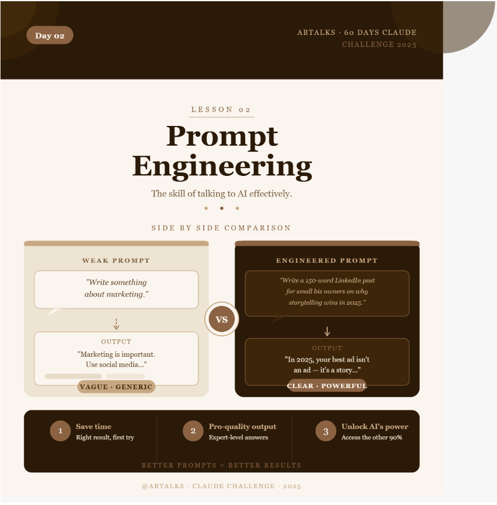

 # Day 2 - Prompt Engineering with MetaPrompt

## Objective

To understand how prompt engineering improves AI-generated outputs by comparing a simple prompt with a structured engineered prompt.

## Tool Used

* Claude AI
* MetaPrompt Chrome Extension

## Prompts Used

### Normal (Lazy) Prompt

Create an image explaining Prompt Engineering.

### Engineered Prompt

Create a visually appealing educational infographic about Prompt Engineering.

Requirements:

* Title: "Prompt Engineering Explained"
* Explain what Prompt Engineering is in simple language.
* Include key components:

  * Role Prompting
  * Context Setting
  * Task Specification
  * Constraints
  * Output Formatting
* Add a step-by-step workflow showing how a prompt is processed.
* Include practical examples for beginners.
* Use modern colors, icons, and clean layout.
* Make the design suitable for students and professionals.
* Add a summary section with best practices.
* High-quality infographic style with clear typography.

## What I Worked On

* Installed and used the MetaPrompt Chrome Extension.
* Generated an image using a simple prompt in Claude AI.
* Generated another image using an engineered prompt.
* Compared both outputs and analyzed the differences.
* Documented the results and uploaded them to GitHub.

## Output Comparison

### Normal Prompt Output

* Simple and basic explanation.
* Limited structure and details.
* Minimal visual organization.

### Engineered Prompt Output

* Better structured and more detailed.
* Professional infographic-style design.
* Included workflow, examples, and best practices.
* More visually appealing and informative.

## What I Learned

* The quality of AI output depends heavily on the quality of the prompt.
* Providing context and clear instructions improves results.
* Structured prompts help AI generate more accurate and useful responses.
* Prompt engineering is an important skill for working effectively with AI tools.
* Small changes in prompts can create significant improvements in output quality.

## Key Takeaway

Prompt engineering transforms a basic AI response into a detailed, professional, and more useful output. Better prompts lead to better results.

## Screenshot

