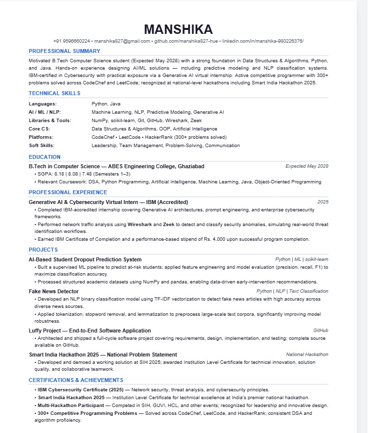

# Day 7 – ATS-Friendly Resume Building

## Objective

The objective of Day 7 was to learn how to create an ATS-friendly resume that can be easily parsed by Applicant Tracking Systems (ATS) while maintaining professional readability for recruiters.

---

## Tools Used

* Claude AI
* VS Code
* GitHub
* ATS Resume Optimization Prompt

---

## Resume Development Process

I used Claude AI to analyze and improve my resume based on ATS best practices. The goal was to ensure that the resume contained relevant keywords, proper formatting, and clear section organization.

The resume was optimized for roles in:

* Artificial Intelligence
* Machine Learning
* Cybersecurity
* Software Development

---

## Key Improvements Made

### Professional Summary

Created a concise summary highlighting:

* B.Tech Computer Science background
* AI/ML experience
* Cybersecurity exposure
* Competitive programming achievements
* Technical problem-solving skills

### Technical Skills Section

Organized skills into categories:

* Programming Languages
* AI / ML / NLP
* Libraries & Tools
* Core Computer Science Subjects
* Coding Platforms
* Soft Skills

### Project Descriptions

Improved project descriptions by:

* Using action-oriented language
* Highlighting technologies used
* Explaining project objectives clearly
* Making achievements measurable wherever possible

### ATS Optimization

Applied ATS best practices such as:

* Standard section headings
* Keyword-rich descriptions
* Simple formatting
* Single-column layout
* No tables or graphics
* Consistent structure

---

## Resume Sections Included

* Professional Summary
* Technical Skills
* Education
* Professional Experience
* Projects
* Certifications & Achievements

---

## Screenshots

### ATS-Friendly Resume

 

---

## Key Learnings

1. ATS systems prioritize keywords and proper formatting.
2. A clean resume structure improves readability.
3. Strong action verbs create a better professional impression.
4. Relevant technical keywords increase resume visibility.
5. Projects should clearly demonstrate skills and impact.
6. AI tools can significantly improve resume quality and optimization.

---

## Challenges Faced

* Identifying important ATS keywords.
* Keeping the resume concise while maintaining important details.
* Organizing technical skills effectively.
* Ensuring the resume remains ATS-compliant without sacrificing readability.

---

## Outcome

Successfully created an ATS-friendly resume optimized for AI, Machine Learning, Cybersecurity, and Software Development opportunities. The exercise improved my understanding of resume optimization, recruiter expectations, and ATS screening processes.

---

## Conclusion

This activity demonstrated how AI-powered tools can help create professional resumes that are both ATS-friendly and recruiter-friendly. Learning ATS optimization techniques will be valuable for future internship and job applications.
